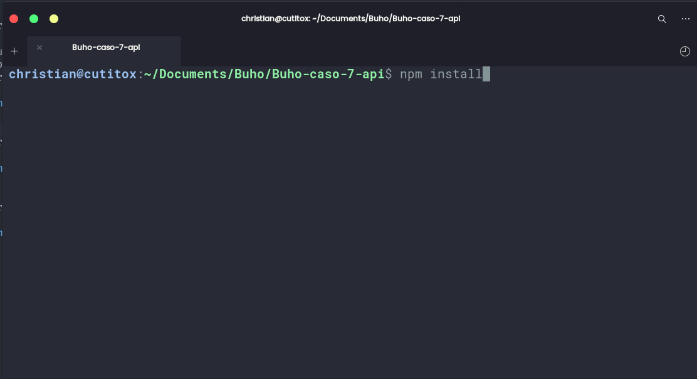
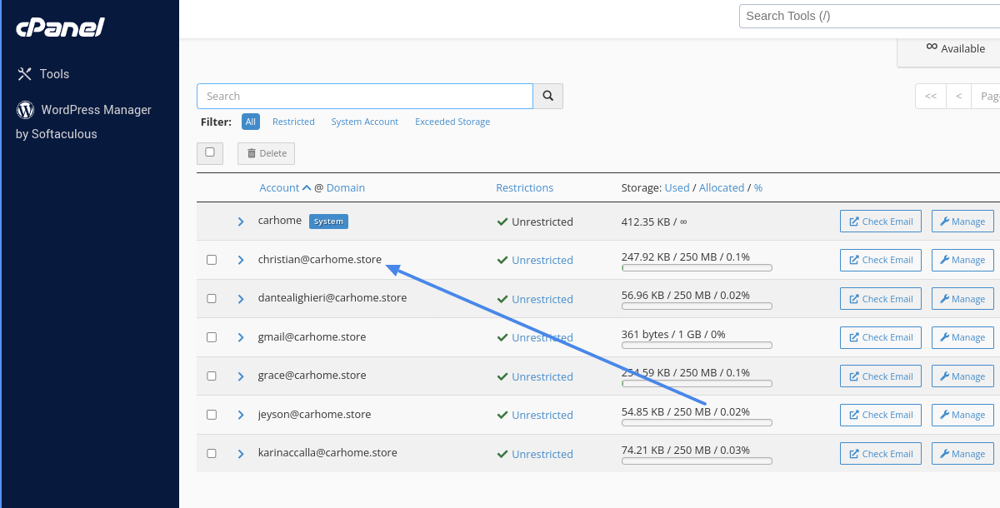

# **Enviar Correos con **NODEMAILER** ** 


# Requisitos:
* Tener instalado [Node JS → ](https://nodejs.org/es)
* Tener instalado [GIT → ](https://git-scm.com/) Opcional

# Instalación:

* Clonaremos el repositorio en nuestra maquina usando el comando ``` git clone https://github.com/1TSpahc/Buho-caso-7-api.git ```. O puedes descargar el zip.


* Ahora instalaremos las dependencias que nescesita el proyecto.

* Si usaste git, solo tienes que ingresar a la terminal en la ruta donde clonaste es repositorio y ejecutar un comando de node js ```npm install``` para que se descargar las dependencias que necesita el proyecto.




* Si descargaste el zip y no tienes git instalado solo tienes que descomprimir el zip/ entrar a la carpteta buho-caso-7-api y abrirla en cualquier terminal y seguir el mismo paso que 👆.


* Ahora abriremos el codigo en ``` nuestro visual studio code``` usando el siguiente comando ```code .```

# Configurar el proyecto:

 Para configura el proyecto solo modificaremos 3 archivos:
* 1: El archivo ``` .evn.example ```.

* Tenemos que renombrar el archivo a ```.env```.(quitemos el ```.example``` del archivo).


* Para obtener los datos que necesita nodemailer usaremos -> ```CPANEL```.





* Y el ```PASSWORD``` es la contrasena con la que incias sesion en  ```cpanel```.


* Y reemplazamos los datos en el archivo ```.env``` con los nuevos datos de ```cpanel```.

* 2: El segundo archivo que modificaremos es el ```src/config/index.js``` en la linea ```13```


* Esa linea es lo que se mostrará en el correo ejemplo ->```Equipo de Carhome``` 👇


* ahora reemplaza esa linea con el texto que quieras.

* 3: El ultimo archivo que modificaremos es el ```src/template/index.js``` que es el ```html``` que se muestra como contenido del correo.


* El template que se muestra por defecto se obtuvo de  [AQUI → ](https://my.stripo.email/cabinet/#/templates/901244)


# Correr la aplicacion:
* Necesitaremos instalar una extencion de Visual studio code 👇


* Ahora deberia aparecer este icono en la barra  ⚡️ 👇


* Abriremos la terminal en la ruta de nuestra aplicacion y ejecutaremos este comando de node ``` npm run dev ```. 👇


* Si ingresamos a ```http://localhost:4000/``` deberia aparecer este mensaje 👇


* Ahora abriremos ```Thunder client``` para probar la api. le damos  click en ```new Request```


* Si insertamos ```http://localhost:4000/``` y le damos a ```send``` el servidor nos deberia responder con un ```Hola!```


* Ahora cambiaremos el metodo de ```GET``` a ```POST```  y la url ```http://localhost:4000/api/email``` y eliminaremos los ```http headers``` para insertar uno nuevo.


* Agregaremos el  ```Content-type```-> ```application/json``` (recuerda guadar los cambios.)


* Ahora nos dirigimos al apartado de ```Body``` y creamos el ```JSON``` que enviaremos, ahi remplazamos el nombre, apellido y el correo del cliente a quien le enviaremos el correo.


* Si el correo se envio con exito el servidor nos responderá con un ```messageId```


